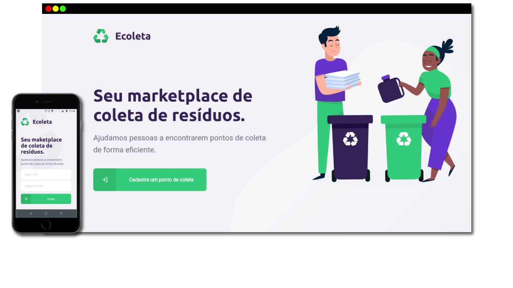

# ECOLETA

<h2 align="center"> Aplicação desenvolvida na Next Level Week 1º Edição promovida pela <a href="https://rocketseat.com.br/"> Rocketseat </a></h2>  

 A 1ª edição da Next Level Week trouxe como projeto uma aplicação 
web e mobile inédita. Um sistema para conectar  empresas e entidades de coleta de 
resíduos orgânicos e inorgânicos as pessoas que precisam descartar seus resíduos de maneira ecológica.

<h1 align="center">
    
</h1>

<h2 align="center"> Desenvolvida com as tecnologias TypeScript,  Node, 
 React,  React Native 
e  SQLite.</h2>

<h3> Outras tecnologias: </h3>
<ul>
  <li> <a href="https://www.npmjs.com/package/nodemon/"> Nodemon </a> </li> 
  <li> <a href="https://expressjs.com/pt-br/"> Express </a> </li>
  <li> <a href="https://www.npmjs.com/package/axios"> Axios </a> </li>
  <li> <a href="https://www.npmjs.com/package/cors"> Cors </a> </li>
  <li> <a href="http://knexjs.org/"> Knex </a> </li>
  <li> <a href="https://expo.io/"> Expo </a> </li>  
</ul>

<h2 align="center"> Layout da aplicação </h2>

<h3>Web</h3>

  

<h3>Mobile</h3>

  

  

